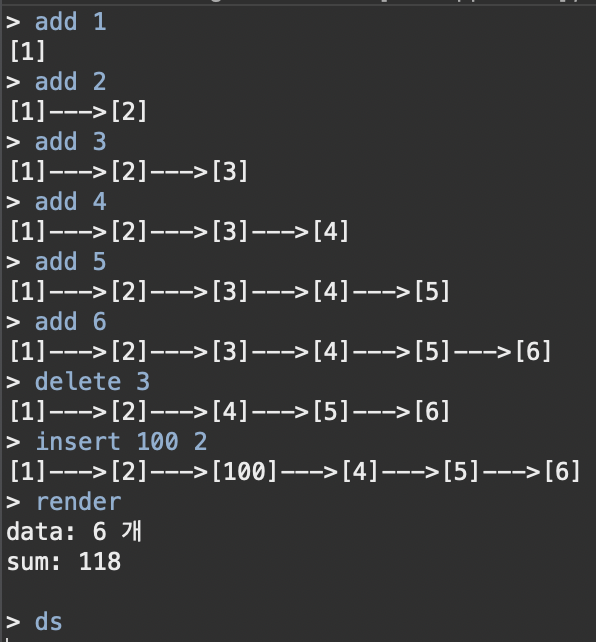

## - Linke list?
List를 만드는 여러 방법중하나
Linked 말그대로 데이터 간의 연결을 통해서 단방향 혹은 양방향으로 소통을 하며 List를 만드는 방법이다

## - Linked list의 메모리 구조

Linked list는 ArrayList와는 다르게 데이터가 서로 떨어져서 저장이된다.
헤더를 통해 첫번째 노드를 파악하고 그 다음 노드가 어디인지 노드에 있는 데이터를 통하여 파악해야한다.

## linked list 구현

- header 선언 : 주소를 헤더에서 관리
```kotlin
class linked{
	val header:Node? = Node()
```	

- Node 선언

```kotlin
	inner class Node{
	var pre: Node? = null
	var next: Node? = null
	var data: Int? = null
	}
```

- add(추가)

```kotlin
	fun add(data: Int?){
		var end = Node()
		end.data = data
		var n:Node? = header
		while(n?.next != null){
			n = n.next!!
		}
		n?.next = end
		n?.next?.pre = header
		print()
	}
```

- delete(삭제)
```kotlin
	fun delete(value: Int){
		var n = header
		while(n?.next!=null){
			if(n.next!!.data!! == value){
				n.next = n.next?.next
				n.next?.pre = n
			}else{
				n = n.next!!
			}
		}
		print()
	}
```

- insert(삽입)

```kotlin
	fun insert(index: Int, data: Int?) {
		var n = header
		var insertData = Node()
		insertData.data = data
		var cnt = 0;
		while(n?.next!=null){
			if(cnt == index){
				insertData.next = n?.next
				insertData.pre = n
				n?.next = insertData
				n?.next!!.pre = insertData
			}else{
				n = n?.next
			}
			cnt++
		}
		print()
	}
```

- render(탐색)
    - 데이터의 개수와 합 출력

```kotlin
	fun render() {
		var n = header
		var cnt = 0
		var sum = 0
		while(n?.next!=null){
			n = n?.next
			sum += n!!.data!!
			cnt++
		}
		println("data: $cnt 개")
		println("sum: $sum ")
	}
```

- 결과 출력 함수

```kotlin
	fun print() {
		var n: Node? = header
		while(n?.next != null){
			print("[${n.next!!.data!!}]")
			n = n.next!!
			if(n.next != null){
				print("--->")
			}
		}
	}
}
```

- 테스트 시작 함수

```kotlin
fun start(n: linked){
	var t = true
	while(t){
		print("> ")
		var str = readLine()
		var cmd = str!!.split(" ")
		if(cmd[0] == "add"){
			n.add(cmd[1].toInt())
		}else if(cmd[0]=="render"){
			n.render()
		}else if(cmd[0] == "delete"){
			n.delete(cmd[1].toInt())
		}else if(cmd[0] == "insert"){
			n.insert(cmd[2].toInt(), cmd[1].toInt())
		}else{
			t = false
		}
		println()
	}
	
}

fun main(args: Array<String>) {
	var n = linked()
	start(n)
}
```


## linked list 테스트

참고  
https://opentutorials.org/module/1335/8821