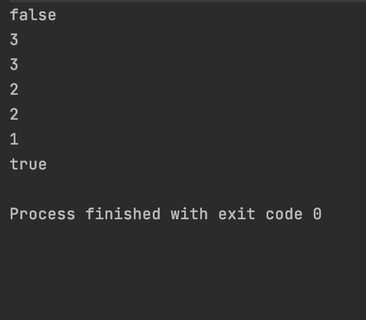

# Stack
## Stack?
스택은 후입후출(FILO) 구조를 가진 자료구조로 상자에서 물건을 꺼내듯 위에 있는(마지막) 데이터를 먼저 꺼내는 자료구조이다. 데이터가 계속해서 쌓이면 스택오버플로우를 일으킨다.

## Stack 구현
링크드리스트를 이용해서 구현하였다. 기능은 push, pop, peek, isEmpty가 있다.

- 추가 push
```kotlin
fun push(data: T) {
        var item = Node<T>(data)
        if(last!=null){
            item.pre = last
        }
        last = item
    }
```
- 마지막 데이터 반환과 삭제 pop
```kotlin
fun pop(): T {
        if(last==null){
            throw NoSuchElementException("Nothing!")
        }
        var data: T = last!!.data
        last = last?.pre
        return data
    }
```
- 마지막 데이터 확인 peek
```kotlin
fun peek(): T{
        if(last==null){
            throw NoSuchElementException("Nothing!")
        }
        return last!!.data
    }
```
- 스택이 비었는지 확인 isEmpty
```kotlin
    fun isEmpty(): Boolean = if(last==null) true else false
```

## test
