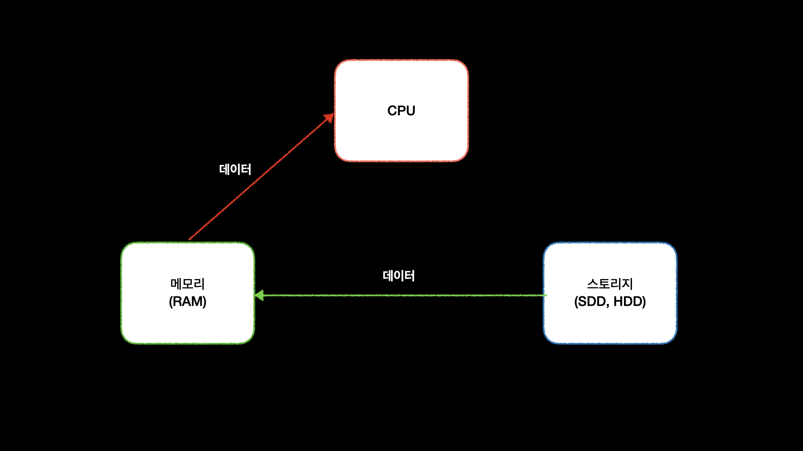

## 메모리

컴퓨터에는 스토리지, 메모리, CPU가 있다.  
스토리지는 SSD,HDD 등을 뜻하고 메모리는 RAM이라고 부르는 부분이다.
스토리지는 값이 싸고 용량이 크고 전원이 꺼져도 데이터가 사라지지 않는다 하지만 속도가 느리다.
메모리는 속도가 빠르지만 용량이 작고 전원이 꺼지면 데이터가 사라지게 된다.
그렇기 때문에 컴퓨터의 데이터는 기본적으로 스토리지에 저장이 된다.
그리고 프로그램을 실행하면 메모리로 옮겨져 CPU에서는 메모리에 있는 데이터를 가져와 사용을 하게된다

우리는 이 메모리를 효율적으로 사용하기 위해서 Data Struture(자료구조)를 알아야한다.